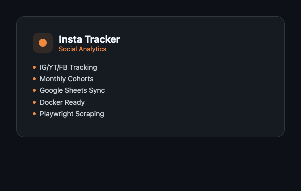

# Insta Tracker

**Social media branding tracker with reel view analytics and monthly cohort analysis.**



---

## What It Does

Insta Tracker monitors reel/video performance across Instagram, YouTube, and Facebook for brand accounts. It scrapes view counts, tracks them over time, and generates monthly cohort analysis to measure content performance trends. Built for the myBillBook social branding team to replace manual view-count tracking with automated, persistent analytics.

---

## Key Features

- **Multi-Platform Scraping** -- Instagram (GraphQL API + Playwright fallback), YouTube (yt-dlp), Facebook (Playwright headless)
- **View Count Tracking** -- Periodic snapshots of reel/video views stored in a local database
- **Monthly Cohort Analysis** -- Group reels by publish month and track cumulative view growth
- **Instagram Auth** -- Session management with 2FA support, cookie persistence, and login/logout controls
- **Web Dashboard** -- FastAPI server with static frontend for viewing analytics
- **Google Sheets Sync** -- Push tracked data to Google Sheets for team access
- **OCR Fallback** -- Tesseract-based view count extraction when APIs fail
- **API Endpoints** -- REST API for programmatic access to all tracking data
- **No-Cache API Middleware** -- Ensures fresh data on every dashboard request
- **Docker Ready** -- Single-command deployment with Playwright and Tesseract pre-installed

---

## Tech Stack

| Layer | Technology |
|-------|-----------|
| Language | Python 3.13 |
| Web Framework | FastAPI + Uvicorn |
| Instagram | Instaloader + GraphQL API |
| YouTube | yt-dlp |
| Facebook | Playwright (headless Chromium) |
| OCR | Tesseract (pytesseract + Pillow) |
| Database | SQLite |
| Sheets Sync | gspread + google-auth |
| HTTP Client | httpx |
| Container | Docker (python:3.13-slim) |

---

## Getting Started

### Prerequisites

- Python 3.11+ (or Docker)
- Tesseract OCR installed (`brew install tesseract` on macOS)
- ffmpeg installed (`brew install ffmpeg` on macOS)

### Installation

```bash
git clone https://github.com/sarthakgoel31/insta-tracker.git
cd insta-tracker
python -m venv .venv
source .venv/bin/activate
pip install -r requirements.txt
python -m playwright install chromium --with-deps
```

### Run

```bash
python server.py
```

### Docker

```bash
docker build -t insta-tracker .
docker run -p 8000:8000 insta-tracker
```

---

## Architecture

The system has two main components: a multi-platform scraper and a FastAPI server. The scraper uses platform-specific strategies -- Instagram's GraphQL API with Playwright as a fallback for checkpoint-blocked sessions, yt-dlp for YouTube, and headless Chromium for Facebook. View count snapshots are stored in SQLite with timestamps for time-series analysis. The FastAPI server serves both the dashboard UI (static files) and REST endpoints, with optional Google Sheets sync for team distribution.

```
Scraper (IG GraphQL / Playwright / yt-dlp)
    --> SQLite (view snapshots with timestamps)
    --> FastAPI Dashboard + Google Sheets Sync
```

---

<p align="center">
  <sub>Built with <a href="https://claude.ai/claude-code">Claude Code</a></sub>
</p>
